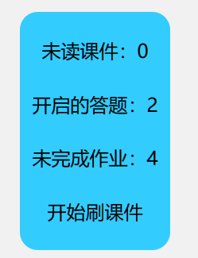

## 微助教助手

通过一点简单的 js 帮助你简化微助教的查询，实现概览面板。

## 使用方法

### 微助教打开方法

在微信中打开微助教后选择“使用浏览器打开”即可进入到浏览器，不存在“请在微信中打开”的情况，原因是微助教将微信提供的code被微助教替换为了openid，不限制是否在微信中打开。

推荐使用油猴，比较省心；不过微助教切换页面并不会刷新，使用 F12 手动执行代码也可以。

### 刷课件方法

刷课件要进入到未读课件列表，再点击开始刷课件。

⚠ 注意：课件阅读时长也会影响微助教得分，所以不建议秒刷秒退。

## ToDo List📜
- [ ] 完善天天学习的Wobsocket ，实现免打开学习。
